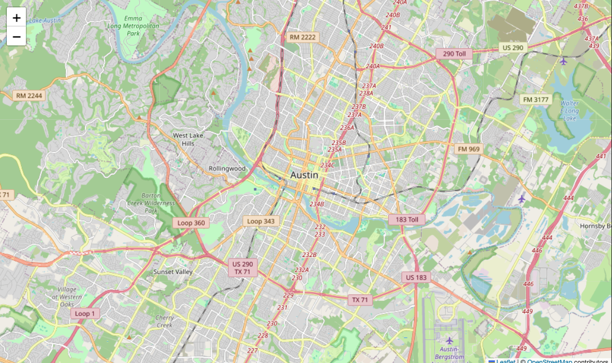
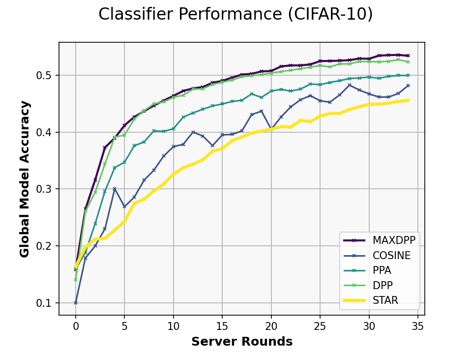
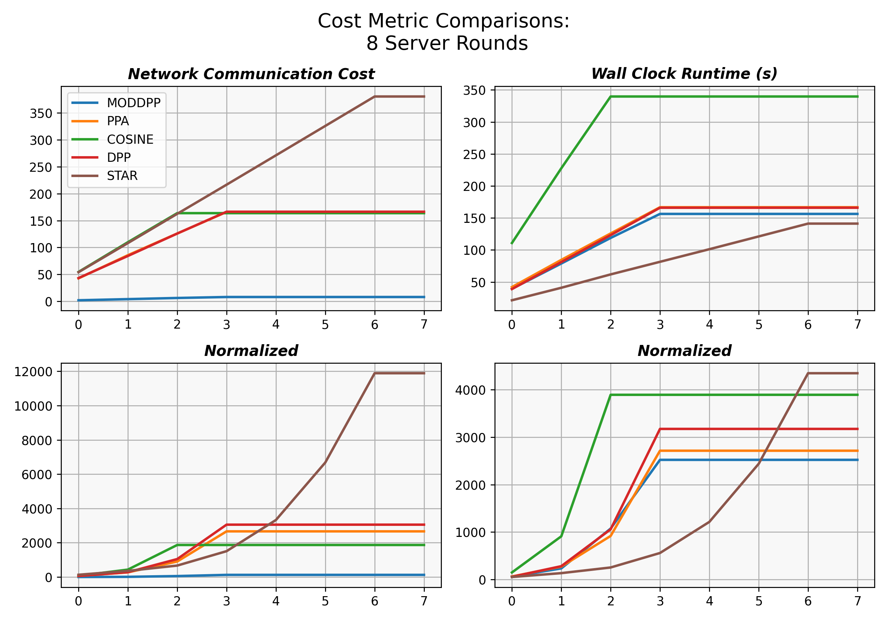

# "TOLAND": Adaptive Topology structures for Mobile Federated Learning

## Structure:
- cloud_v2.py : runs the project, based on config inputs. Also is the basic template of "Mobile Hierarchical FL" -- it calls custom algorithms stored in "netsim"
- mobile_dataset: To see how we creted mobility datasets check `mobility_dataset.' A visualization is included there
- configs :  Includes single config file we use to call various algorithms or cases
- netsim : this is where we store our network simulation + custom FL algorithms
    - basenetwork ,  basealgorithm include basic templates for running hierarchical FL
    - milestone2 contains most of the relevant algorithms
    - milestone1 is legacy and milestone3 is a "futre work" algorithm
- plots_and_analysis:
    - includes final data put into the report
    - also includes our code for generating plots
- demo_modularity_concept.py  -- runs a visulization of how this "future cpncept" would work
- utils.py and data_prepare contains most of the ML side of things 

